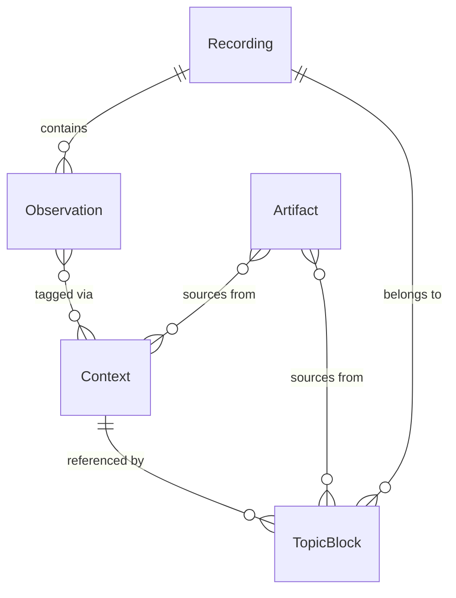

# ADR-003: Context-First Observation Model

## Status
Accepted

## Date
2026-01-20

## Appendix: Implementation Learnings (Phase 3C)

### OCR Quality Findings
Tesseract on screen recordings produces high-quality text for code and terminal views but generates significant noise from menu bars, system clocks, and status indicators. 
**Solution**: A post-processing filter (`src/utils/ocr.ts`) cleans these artifacts before they reach the embedding service, preventing "hallucinated" semantic similarities between unrelated segments.

### Embedding Success Rate
With the OCR cleanup utility, the success rate for `nomic-embed-text` reached **99.7%** (1771/1776 observations). The rare failures correspond to nonsensical character strings that are correctly rejected by the model.

### VLM Benchmarks for Phase 3D.5
Testing various Vision-Language Models (VLM) for technical activity description:

| Model | tok/s | Quality | Recommended For |
|-------|-------|---------|-----------------|
| **MiMo VL 7B RL GGUF Q4_K_S** | 78 | Highest | Deep analysis of code structure & specific files. |
| **qwen3-vl-8b** | 77 | High | General technical activity (Default). |
| **qwen3-vl-4b** | 115 | Medium | Fast processing where high detail isn't critical. |
| **minicpm-v:8b** | - | Low | Not recommended (too generic). |

### Processing Pipeline Timing (Sample: 1hr Recording)
| Phase | Duration |
|-------|----------|
| OCR Processing (1776 frames) | 321.8s |
| Embedding Generation | 35.3s |
| **Total Visual Pipeline** | **357.1s (~6 mins)** |

*Note: Audio pipeline duration varies significantly based on speech density.*

## Context

### Problem Statement

Escribano's current architecture uses a Session-centric model where:
1. `Session` is the aggregate root containing `transcripts[]` and `visualLogs[]`
2. CLIP embeddings cluster frames by **visual similarity**, not semantic meaning
3. `SessionSegment` groups clusters by adjacency and heuristic labels
4. Context extraction uses rigid regex patterns

This causes several critical issues:

| Issue | Example | Root Cause |
|-------|---------|------------|
| Scattered clusters | Cluster 22 spans 58 minutes with 28 gaps | CLIP groups by visual similarity, not temporal/semantic coherence |
| Noise contamination | 45-min work session marked as noise | Single YouTube Music frame pollutes entire segment |
| Whisper hallucinations | "www.amara.org" repeated for 10+ minutes | No audio preprocessing or hallucination filtering |
| Rigid context detection | Only detects hardcoded apps/URLs | Regex-based, no semantic understanding |
| No cross-recording queries | Cannot query "all time on project X" | Session is the aggregate root, artifacts locked inside |
| Data redundancy | `transcriptSlice` copies transcript portions | Data duplication instead of references |

### Goals

1. Enable semantic grouping of observations (by topic, not visual appearance)
2. Support cross-recording queries (e.g., "all blocks where context = escribano")
3. Normalize data model to eliminate redundancy
4. Allow artifacts to be generated from multiple recordings
5. Handle multimodal context inference (terminal + system audio = learning session)

## Decision

Adopt a **Context-First Observation Model** with separate aggregate roots:

### Aggregate Roots

```
Recording    → Raw capture, owns Observations
Context      → Cross-recording semantic label
TopicBlock   → Per-recording segment, references Contexts
Artifact     → Generated content, can source from Blocks OR Contexts
```

### Core Entities

**Recording** (Aggregate Root)
- id: string
- videoPath, audioPath
- status: 'raw' | 'processing' | 'processed' | 'error'
- Observations[]: extracted, immutable

**Observation** (Entity, immutable content)
- id: UUIDv7
- recordingId: FK
- type: 'visual' | 'audio'
- timestamp (visual) or timeRange (audio)
- data: { ocrText, imagePath, vlmDescription? } or { text, source, audioType }
- embedding?: number[]

**Context** (Aggregate Root, cross-recording)
- id: UUIDv7
- type: string (extensible: project, app, url, topic, etc.)
- name: human-readable
- metadata: { userMerges?, createdAt }

**TopicBlock** (Aggregate Root, per-recording)
- id: UUIDv7
- recordingId: FK
- contextIds: FK[]
- classification?: Classification (optional enrichment)
- (observationIds derived via ObservationContext join + timeRange)

**Artifact** (Aggregate Root)
- id: UUIDv7
- type: 'summary' | 'runbook' | 'notes' | ...
- content: markdown
- sourceBlockIds: FK[] (single recording)
- sourceContextIds: FK[] (cross-recording)

### Relationships



### Processing Flow

1. **CAPTURE**: Recording detected (Cap watcher)
2. **EXTRACTION**: Recording → Observations[]
   - Visual: FFmpeg → Tesseract OCR → Observation
   - Audio: Silero VAD → Whisper → Observation (with audioType)
   - Optional: VLM for OCR-sparse frames → vlmDescription
3. **CLUSTERING**: Observations[] → Clusters[]
   - Embed OCR+audio text (nomic-embed-text)
   - Cluster by semantic similarity (not CLIP visual similarity)
4. **CONTEXT DERIVATION**: For each Cluster:
   - LLM analyzes observations, extracts signals
   - Match existing Context OR create new
   - Create ObservationContext links
   - Form TopicBlock
5. **CLASSIFICATION** (optional): TopicBlock → Classification (for artifact type suggestions)
6. **ARTIFACTS**: Generate from TopicBlock(s) or Context(s)
7. **PUBLISHING**: Sync to Outline (or other destinations)

## Consequences

### Positive

1. **Cross-recording queries**: `TopicBlockRepository.findByContext("project-escribano")` returns blocks from all recordings
2. **No data redundancy**: Observations referenced by ID, not copied
3. **Semantic clustering**: Text embeddings group by meaning, not appearance
4. **Many-to-many contexts**: One observation can belong to multiple contexts (split screen)
5. **Flexible artifacts**: Can generate from single block OR entire context history
6. **Better noise handling**: YouTube Music is its own context, doesn't pollute work contexts

### Negative

1. **More entities to manage**: 4 aggregate roots instead of 1
2. **Join complexity**: Must traverse ObservationContext to get observations for a context
3. **Context matching**: Need algorithm to match new signals to existing contexts
4. **Migration**: Existing sessions incompatible (greenfield approach)

### Neutral

1. **Classification becomes optional**: Still useful for artifact suggestions, but not a blocker
2. **Storage format**: SQLite (ADR-004) enables efficient relational queries

## Alternatives Considered

### A: Keep Session as Aggregate Root
- **Rejected**: Cannot query across recordings, artifacts locked inside session

### B: Context as Sole Aggregate Root
- **Rejected**: Too abstract, unclear where artifacts live, observation ownership unclear

### C: Time-based Segments (current approach)
- **Rejected**: CLIP visual similarity creates scattered, non-contiguous segments
