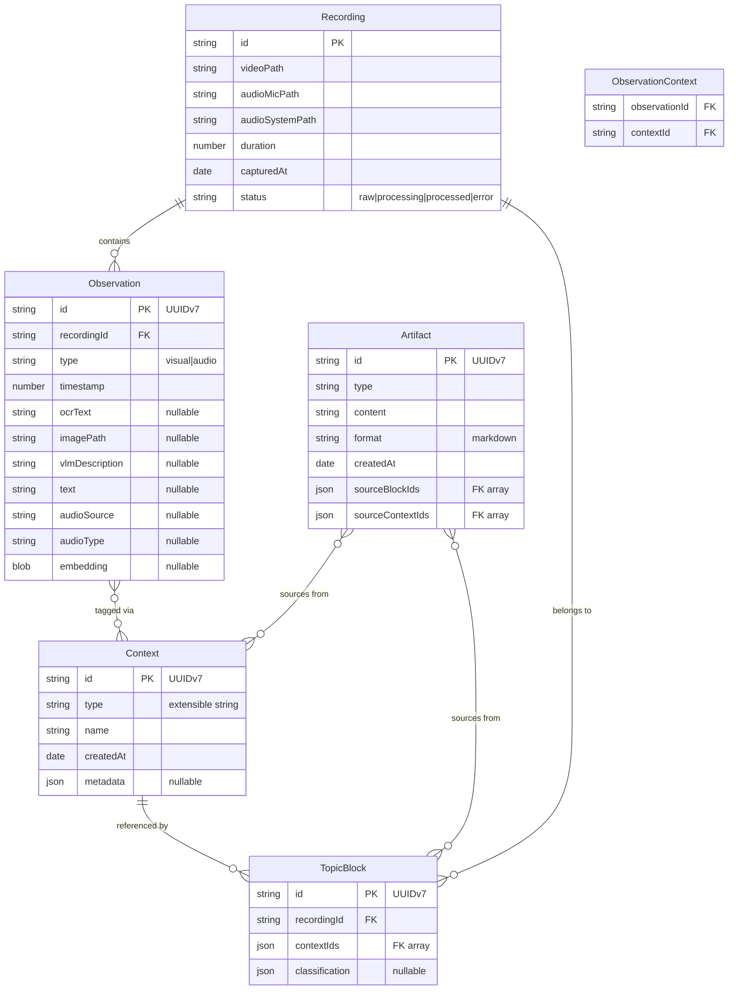

# Escribano Architecture

## Overview

Escribano follows **Domain-Driven Design (DDD)** and **Clean Architecture** principles to ensure the core business logic remains independent of external systems and frameworks.

Its mission is to **observe, understand, and document work sessions** by processing multimodal inputs (Audio + Video), enabling deep understanding of both spoken meetings and silent coding sessions.

## Core Principles

### 1. The Dependency Rule (Inward Dependencies)

Dependencies point inward. The domain layer knows **nothing** about adapters, databases, or external APIs.

```text
┌─────────────────────────────────────────────────────────────────┐
│                     INFRASTRUCTURE (Adapters)                   │
│   (cap, whisper, ffmpeg, ollama, fs)                            │
│   (Naming: [port].[implementation].adapter.ts)                  │
├─────────────────────────────────────────────────────────────────┤
│                     APPLICATION (Use Cases)                     │
│   (ProcessSession, ClassifySession, GenerateArtifact)           │
│   (Orchestrates the Domain and calls Ports)                     │
├─────────────────────────────────────────────────────────────────┤
│                       DOMAIN (Core)                             │
│   (Entities: Session, Artifact)                                 │
│   (Value Objects: Transcript, VisualLog, Classification)        │
│   (Pure Business Logic & Rules)                                 │
└─────────────────────────────────────────────────────────────────┘
```

### 2. Ports & Adapters

External systems are abstracted behind ports (interfaces). This project follows a strict naming convention: `src/adapters/[port].[implementation].adapter.ts`.

This allows:
- **Swapping implementations:** (e.g., Switch from local `whisper.cpp` to OpenAI API by adding `transcription.openai.adapter.ts` without touching business logic).
- **Testability:** Easy testing with mock adapters.
- **Evolution:** Adding new capabilities (like Video Processing) by adding new Ports, not rewriting the core.

### 3. Domain Events

State changes emit domain events, enabling loose coupling and event-driven automation.
- `SessionRecorded`: A new capture has been detected.
- `VisualLogExtracted`: Screenshots/scenes have been processed.
- `SessionClassified`: The AI has determined the session type.
- `ArtifactGenerated`: A document has been created.

## Domain Model (v2: Context-First)

> **Note**: This model replaces the Session-centric v1 model. See ADR-003 for rationale.

### Aggregate Roots

Escribano uses four separate aggregate roots to enable cross-recording queries and normalized data:



### Entity Definitions

**Recording** - Raw capture from screen recording tool
- Aggregate root for observations
- Status tracks processing lifecycle
- References original source metadata

**Observation** - Timestamped evidence from a recording
- Visual: frame + OCR text + optional VLM description
- Audio: transcript segment + source (mic/system) + type (speech/silence/music)
- Immutable content, can add enrichments (vlmDescription)

**Context** - Semantic label, cross-recording
- Types: project, app, url, topic, etc. (extensible)
- Persists across recordings
- Matched by name or semantic similarity

**TopicBlock** - Coherent segment of work
- Per-recording, references contexts
- Observations derived via `ObservationContext` join table
- Optional classification enrichment

**Artifact** - Generated content
- Sources from blocks (single recording) or contexts (cross-recording)
- Markdown format with embedded images

---

## Processing Pipeline (v2)

```text
┌─────────────────────────────────────────────────────────────────────────────┐
│                      PROCESSING PIPELINE (v2)                                │
├─────────────────────────────────────────────────────────────────────────────┤
│                                                                              │
│  ┌─────────────┐                                                            │
│  │  CAPTURE    │  Recording detected (Cap watcher)                          │
│  └──────┬──────┘                                                            │
│         │                                                                   │
│         ▼                                                                   │
│  ┌─────────────────────────────────────────────────────────────────────────┐│
│  │                         EXTRACTION                                       ││
│  ├──────────────────────────────────┬──────────────────────────────────────┤│
│  │         VISUAL TRACK             │           AUDIO TRACK                ││
│  │  FFmpeg → Tesseract → OCR        │  Silero VAD → Whisper → Transcript   ││
│  │  Optional: VLM for sparse frames │  + Hallucination filtering           ││
│  └──────────────────────────────────┴──────────────────────────────────────┘│
│         │                                                                   │
│         ▼                                                                   │
│  ┌─────────────────────────────────────────────────────────────────────────┐│
│  │                         CLUSTERING                                       ││
│  │  1. Embed observations (nomic-embed-text on OCR + audio text)           ││
│  │  2. Cluster by semantic similarity (not visual CLIP)                    ││
│  │  3. Each cluster = proto-TopicBlock                                     ││
│  └─────────────────────────────────────────────────────────────────────────┘│
│         │                                                                   │
│         ▼                                                                   │
│  ┌─────────────────────────────────────────────────────────────────────────┐│
│  │                     CONTEXT DERIVATION                                   ││
│  │  For each cluster:                                                      ││
│  │    1. LLM analyzes observations → extracts signals                      ││
│  │    2. Context matching:                                                 ││
│  │       - Exact name match → reuse existing Context                       ││
│  │       - Fuzzy/embedding match → suggest merge                           ││
│  │       - No match → create new Context                                   ││
│  │    3. Create ObservationContext links                                   ││
│  │    4. Form TopicBlock referencing Context(s)                            ││
│  └─────────────────────────────────────────────────────────────────────────┘│
│         │                                                                   │
│         ▼                                                                   │
│  ┌─────────────────────────────────────────────────────────────────────────┐│
│  │                     ARTIFACT GENERATION                                  ││
│  │  Source: TopicBlock(s) → single-recording artifact                      ││
│  │          Context(s) → cross-recording artifact                          ││
│  │  Observations provide imagePath for screenshot embedding                ││
│  └─────────────────────────────────────────────────────────────────────────┘│
│         │                                                                   │
│         ▼                                                                   │
│  ┌─────────────┐                                                            │
│  │  PUBLISH    │  Sync to Outline, export, etc.                             │
│  └─────────────┘                                                            │
│                                                                              │
└─────────────────────────────────────────────────────────────────────────────┘
```

### Audio Preprocessing (Whisper Hallucination Prevention)

Based on dialectical research, Escribano uses a hybrid approach:

1. **Silero VAD** for semantic speech detection (not FFmpeg amplitude)
2. **Whisper threshold parameters** for recovery from hallucination loops
3. **Post-filtering** known hallucination patterns as final safety net

```text
Audio File
    │
    ▼
┌─────────────────────────────────────┐
│  Silero VAD                         │
│  min_silence_duration: 1000ms       │
│  (semantic speech detection)        │
└───────────────┬─────────────────────┘
                │ Speech segments only
                ▼
┌─────────────────────────────────────┐
│  Whisper with thresholds            │
│  no_speech_threshold: 0.5           │
│  compression_ratio_threshold: 2.4   │
│  logprob_threshold: -1.0            │
└───────────────┬─────────────────────┘
                │
                ▼
┌─────────────────────────────────────┐
│  Hallucination Filter               │
│  - "Untertitel der Amara.org"       │
│  - "Thanks for watching"            │
│  - Repetition loops (.{20,})\1{4,}  │
└───────────────┬─────────────────────┘
                │
                ▼
           AudioObservation[]
```

---

## Storage Layer (SQLite)

Escribano uses SQLite for persistent storage, located at `~/.escribano/escribano.db`.

**Stack**:
- **better-sqlite3**: Synchronous driver for Node.js
- **kysely-codegen**: Generate TypeScript types from schema
- **Custom migrations**: SQL files in `migrations/` directory at project root

**Configuration**:
```sql
PRAGMA journal_mode = WAL;    -- Write-ahead logging
PRAGMA synchronous = NORMAL;  -- Balance safety/speed
```

### Repository Pattern

Domain code accesses data through repository interfaces:

```typescript
interface ContextRepository {
  findById(id: string): Context | null;
  findByTypeAndName(type: string, name: string): Context | null;
  findSimilar(name: string, threshold: number): Context[];
  save(context: Context): void;
}

interface TopicBlockRepository {
  findById(id: string): TopicBlock | null;
  findByRecording(recordingId: string): TopicBlock[];
  findByContext(contextId: string): TopicBlock[];  // Cross-recording query
  save(block: TopicBlock): void;
}
```

This enables storage backend swaps (e.g., SQLite → Turso) without changing domain code.

---

## Ports (Updated)

| Port | Adapter | Purpose |
|------|---------|---------|
| `CaptureSource` | `capture.cap.adapter.ts` | Watch for Cap recordings |
| `TranscriptionService` | `transcription.whisper.adapter.ts` | Audio → Text (whisper.cpp) |
| `VideoService` | `video.ffmpeg.adapter.ts` | Frame extraction, visual indexing |
| `IntelligenceService` | `intelligence.ollama.adapter.ts` | LLM classification & generation |
| `EmbeddingService` | `embedding.ollama.adapter.ts` | Text → Vector embeddings |
| `StorageService` | `storage.fs.adapter.ts` | Persist sessions/artifacts |
| `PublishingService` | `publishing.outline.adapter.ts` | Sync to Outline wiki |

