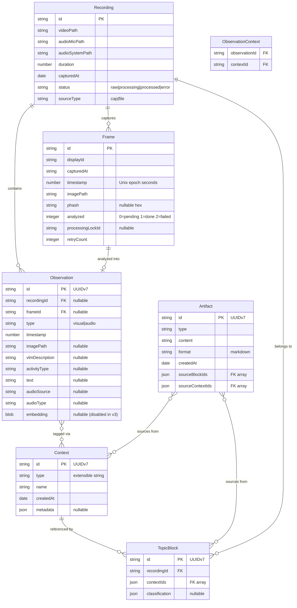

# Escribano Architecture

## Overview

Escribano follows **Domain-Driven Design (DDD)** and **Clean Architecture** principles to ensure the core business logic remains independent of external systems and frameworks.

Its mission is to **observe, understand, and document work sessions** by processing multimodal inputs (Audio + Video), enabling deep understanding of both spoken meetings and silent coding sessions.

## Core Principles

### 1. The Dependency Rule (Inward Dependencies)

Dependencies point inward. The domain layer knows **nothing** about adapters, databases, or external APIs.

```text
┌─────────────────────────────────────────────────────────────────┐
│                     INFRASTRUCTURE (Adapters)                   │
│   (cap, whisper, ffmpeg, ollama, fs)                            │
│   (Naming: [port].[implementation].adapter.ts)                  │
│├─────────────────────────────────────────────────────────────────┤
│                     APPLICATION (Use Cases)                     │
│   (ProcessRecordingV3, GenerateSummaryV3, GenerateArtifactV3)   │
│   (Orchestrates the Domain and calls Ports)                     │
│├─────────────────────────────────────────────────────────────────┤
│                     SERVICES (Pure Logic)                        │
│   (frame-sampling, activity-segmentation, temporal-alignment)   │
│   (No I/O, no env vars, no adapters — pure functions only)      │
│├─────────────────────────────────────────────────────────────────┤
│                       DOMAIN (Core)                             │
│   (Entities: Recording, Observation, Context, TopicBlock)       │
│   (Value Objects: Transcript, TimeRange, Classification)        │
│   (Pure Business Logic & Rules)                                 │
└─────────────────────────────────────────────────────────────────┘
```

### 2. Ports & Adapters

External systems are abstracted behind ports (interfaces). This project follows a strict naming convention: `src/adapters/[port].[implementation].adapter.ts`.

This allows:
- **Swapping implementations:** (e.g., Switch from local `whisper.cpp` to OpenAI API by adding `transcription.openai.adapter.ts` without touching business logic).
- **Testability:** Easy testing with mock adapters.
- **Evolution:** Adding new capabilities (like Video Processing) by adding new Ports, not rewriting the core.

### 3. State Machine Transitions

Recording lifecycle is managed by a state machine in `src/domain/recording.ts`:
- `raw` → `processing` (via `startProcessing`)
- `processing` → step advancement (via `advanceStep`)
- `processing` → `processed` (via `completeProcessing`)
- `processing` → `error` (via `failProcessing`)

## Domain Model (v3: VLM-First + Swift-Native Recorder)

> **Note**: This model evolves the v2 model to a VLM-first approach. See ADR-005 for rationale.
> **Recorder**: Phase 2 (ADR-010) adds Swift-native in-process VLM analysis alongside the batch pipeline.

### Processing Topology

Escribano now runs in **two parallel paths**, sharing the same database and domain model:

1. **Batch Pipeline (TypeScript)**: `--file` mode, Cap recordings, etc.
   - Audio: Silero VAD → Whisper → observations
   - Video: FFmpeg → frames → (Python bridge) MLX-VLM → observations
   - Segmentation: observations → TopicBlocks → LLM artifacts

2. **Always-On Recorder (Swift)**: LaunchAgent, continuous capture
   - Capture: SCStream → frames table (pHash dedup)
   - Analysis: Python bridge MLX-VLM → observations (via Unix socket to mlx_bridge.py)
   - Segmentation: Same TS logic as batch (observations → TopicBlocks)

**Key insight**: The `observations` table is the canonical intermediate output. Both paths write to it, and all downstream logic (segmentation, artifacts) reads from it, enabling unified processing.

### Aggregate Roots

Escribano uses four separate aggregate roots to enable cross-recording queries and normalized data:


```mermaid
erDiagram
    Recording ||--o{ Observation : contains
    Recording ||--o{ Frame : "captures"
    Frame ||--o| Observation : "analyzed into"
    Observation }o--o{ Context : "tagged via"
    Context ||--o{ TopicBlock : "referenced by"
    TopicBlock }o--|| Recording : "belongs to"
    Artifact }o--o{ TopicBlock : "sources from"
    Artifact }o--o{ Context : "sources from"

    Recording {
        string id PK
        string videoPath
        string audioMicPath
        string audioSystemPath
        number duration
        date capturedAt
        string status "raw|processing|processed|error"
        string sourceType "cap|file"
    }

    Frame {
        string id PK
        string displayId
        string capturedAt
        number timestamp "Unix epoch seconds"
        string imagePath
        string phash "nullable hex"
        integer analyzed "0=pending 1=done 2=failed"
        string processingLockId "nullable"
        integer retryCount
    }

    Observation {
        string id PK "UUIDv7"
        string recordingId FK "nullable"
        string frameId FK "nullable"
        string type "visual|audio"
        number timestamp
        string imagePath "nullable"
        string vlmDescription "nullable"
        string activityType "nullable"
        string text "nullable"
        string audioSource "nullable"
        string audioType "nullable"
        blob embedding "nullable (disabled in v3)"
    }

    Context {
        string id PK "UUIDv7"
        string type "extensible string"
        string name
        date createdAt
        json metadata "nullable"
    }

    ObservationContext {
        string observationId FK
        string contextId FK
    }

    TopicBlock {
        string id PK "UUIDv7"
        string recordingId FK
        json contextIds "FK array"
        json classification "nullable"
    }

    Artifact {
        string id PK "UUIDv7"
        string type
        string content
        string format "markdown"
        date createdAt
        json sourceBlockIds "FK array"
        json sourceContextIds "FK array"
    }
```

### Entity Definitions

**Recording** - Raw capture from screen recording tool
- Aggregate root for observations
- Status tracks processing lifecycle
- References original source metadata

**Observation** - Timestamped evidence from a recording
- Visual: frame + VLM description + Activity Type
- Audio: transcript segment + source (mic/system) + type (speech/silence/music)
- Immutable content, can add enrichments

**Context** - Semantic label, cross-recording
- Types: project, app, url, topic, etc. (extensible)
- Persists across recordings
- Matched by name or semantic similarity

**TopicBlock** - Coherent segment of work
- Per-recording, references contexts
- Observations derived via `ObservationContext` join table
- Optional classification enrichment

**Artifact** - Generated content
- Sources from blocks (single recording) or contexts (cross-recording)
- Markdown format with embedded images

---

## Processing Pipeline (v3: VLM-First)

> **See ADR-005 for detailed rationale.**

```text
┌─────────────────────────────────────────────────────────────────────────────┐
│                      PROCESSING PIPELINE (v3)                               │
├─────────────────────────────────────────────────────────────────────────────┤
│                                                                              │
│  ┌─────────────┐                                                            │
│  │  CAPTURE    │  Recording detected (Cap watcher or direct file input)     │
│  └──────┬──────┘                                                            │
│         │                                                                   │
│         ▼                                                                   │
│  ┌─────────────────────────────────────────────────────────────────────────┐│
│  │                      FRAME SAMPLING                                      ││
│  │  Adaptive Sampling: 10s base + gap fill (>15s)                          ││
│  │  Output: ~25% of original frames                                        ││
│  └──────────────────────────────────────────────────────────────────────────┘│
│         │                                                                   │
│         ▼                                                                   │
│  ┌─────────────────────────────────────────────────────────────────────────┐│
│  │                      VLM BATCH INFERENCE                                 ││
│  │  1. Interleaved batch processing (4 frames/batch)                       ││
│  │  2. MLX-VLM (Qwen3-VL-2B) identifies activity & context                 ││
│  │  3. Store results in Observation entity                                  ││
│  └──────────────────────────────────────────────────────────────────────────┘│
│         │                                                                   │
│         ▼                                                                   │
│  ┌─────────────────────────────────────────────────────────────────────────┐│
│  │                      ACTIVITY SEGMENTATION                               ││
│  │  1. Group consecutive observations by activity continuity                ││
│  │  2. Each segment = TopicBlock                                           ││
│  └──────────────────────────────────────────────────────────────────────────┘│
│         │                                                                   │
│         ▼                                                                   │
│  ┌─────────────────────────────────────────────────────────────────────────┐│
│  │                      TEMPORAL ALIGNMENT                                  ││
│  │  Attach audio transcripts to TopicBlocks by timestamp overlap           ││
│  │  (Eliminates unreliable semantic embedding merge)                        ││
│  └──────────────────────────────────────────────────────────────────────────┘│
│         │                                                                   │
│         ▼                                                                   │
│  ┌─────────────────────────────────────────────────────────────────────────┐│
│  │                     CONTEXT DERIVATION                                   ││
│  │  Extract labels (apps, topics) from VLM descriptions                     ││
│  │  Match to existing Contexts or create new                               ││
│  └──────────────────────────────────────────────────────────────────────────┘│
│         │                                                                   │
│         ▼                                                                   │
 │  ┌─────────────────────────────────────────────────────────────────────────┐│
  │  │  ARTIFACT GENERATION                                  ││
  │  │                                                      ││
  │  │  1. [VLM] Unload model → free memory (~2GB)      ││
  │  │  2. [LLM] Load model (Qwen3.5-27B or 9B)        ││
  │  │  3. Subject grouping (if card/standup)               ││
  │  │                                                      ││
  │  │  ┌──────────────────┐                                   ││
  │  │  │ format === 'narrative'?                             ││
  │  │  └────────┬─────────┘                                   ││
  │  │      YES  │   NO (card/standup)                             ││
  │  │           │                                             ││
  │  │          ▼           ▼                                          ││
  │  │  ┌─────────────┐  ┌─────────────────┐                               ││
  │  │  │ generate-   │  │ generate-       │                               ││
  │  │  │ summary-v3  │  │ artifact-v3     │                               ││
  │  │  └──────┬──────┘  └────────┬────────┘                               ││
  │  │         │                  │                                    ││
  │  │         ▼                  ▼                                    ││
  │  │  TopicBlocks →        Subjects →                            ││
  │  │  Activity Timeline    Subject Data                            ││
  │  │         │                  │                                    ││
  │  │         ▼                  ▼                                    ││
  │  │  summary-v3.md         card.md / standup.md                         ││
  │  │  (all vars filled)     (all vars filled)                            ││
  │  │         │                  │                                    ││
  │  │         └────────┬─────────┘                                    ││
  │  │                  ▼                                             ││
  │  │           Markdown Artifact                                    ││
  │  │                                                      ││
  │  │  4. [LLM] Unload model → free memory (~14-20GB)   ││
  │  └──────────────────────────────────────────────────────────────────────────┘│
│                                                                              │
└─────────────────────────────────────────────────────────────────────────────┘
```

### Audio Preprocessing (Whisper Hallucination Prevention)

Based on dialectical research, Escribano uses a hybrid approach:

1. **Silero VAD** for semantic speech detection (not FFmpeg amplitude)
2. **Whisper threshold parameters** for recovery from hallucination loops
3. **Post-filtering** known hallucination patterns as final safety net

```text
Audio File
    │
    ▼
┌─────────────────────────────────────┐
│  Silero VAD                         │
│  min_silence_duration: 1000ms       │
│  (semantic speech detection)        │
└───────────────┬─────────────────────┘
                │ Speech segments only
                ▼
┌─────────────────────────────────────┐
│  Whisper with thresholds            │
│  no_speech_threshold: 0.5           │
│  compression_ratio_threshold: 2.4   │
│  logprob_threshold: -1.0            │
└───────────────┬─────────────────────┘
                │
                ▼
┌─────────────────────────────────────┐
│  Hallucination Filter               │
│  - "Untertitel der Amara.org"       │
│  - "Thanks for watching"            │
│  - Repetition loops (.{20,})\1{4,}  │
└───────────────┬─────────────────────┘
                │
                ▼
           AudioObservation[]
```

---

## Storage Layer (SQLite)

Escribano uses SQLite for persistent storage, located at `~/.escribano/escribano.db`.

**Stack**:
- **better-sqlite3**: Synchronous driver for Node.js
- **Manual Types**: TypeScript interfaces matching the database schema in `src/db/types.ts`
- **Custom migrations**: SQL files in `migrations/` directory at project root

**Configuration**:
```sql
PRAGMA journal_mode = WAL;    -- Write-ahead logging
PRAGMA synchronous = NORMAL;  -- Balance safety/speed
```

### Repository Pattern

Domain code accesses data through repository interfaces:

```typescript
interface ContextRepository {
  findById(id: string): Context | null;
  findByTypeAndName(type: string, name: string): Context | null;
  findSimilar(name: string, threshold: number): Context[];
  save(context: Context): void;
}

interface TopicBlockRepository {
  findById(id: string): TopicBlock | null;
  findByRecording(recordingId: string): TopicBlock[];
  findByContext(contextId: string): TopicBlock[];  // Cross-recording query
  save(block: TopicBlock): void;
}
```

This enables storage backend swaps (e.g., SQLite → Turso) without changing domain code.

---

## Ports (v3)

| Port | Adapter | Purpose |
|------|---------|---------|
| **Batch Pipeline** | | |
| `CaptureSource` | `capture.cap.adapter.ts` | Watch for Cap recordings |
| `CaptureSource` | `capture.filesystem.adapter.ts` | Direct file input |
| `TranscriptionService` | `transcription.whisper.adapter.ts` | Audio → Text (whisper.cpp) |
| `VideoService` | `video.ffmpeg.adapter.ts` | Frame extraction, visual indexing |
| `AudioPreprocessor` | `audio.silero.adapter.ts` | VAD segmentation & cleanup |
| `IntelligenceService` | `intelligence.mlx.adapter.ts` | **Unified MLX adapter**: VLM (frame analysis via Python bridge) + LLM (text generation) |
| `IntelligenceService` | `intelligence.ollama.adapter.ts` | **Alternative**: LLM inference for summary generation (configurable backend) |
| **Always-On Recorder (Swift)** | | |
| `FrameStore` | `FrameStore.sqlite.adapter.swift` | Swift-native frame lifecycle (insert, claim, mark analyzed/failed) |
| `ObservationStore` | `ObservationStore.sqlite.adapter.swift` | Swift-native observation persistence (save, fetch unclaimed, claim) |
| `TopicBlockStore` | `TopicBlockStore.sqlite.adapter.swift` | TopicBlock persistence (save, count) |
| `VLMInferenceService` | `PythonBridge.vlm.adapter.swift` | Swift → Python bridge adapter (Unix socket, `mlx_bridge.py`) |
| `TextGenerationService` | `PythonBridge.vlm.adapter.swift` | Text-only generation via VLM bridge (same socket, `text_infer`) |
| `ResponseParser` | `ResponseParser.swift` | Decoupled VLM output parsing |
| **Publishing** | | |
| `PublishingService` | `publishing.outline.adapter.ts` | Outline wiki publishing |
| **Deprecated** | | |
| `EmbeddingService` | `embedding.ollama.adapter.ts` | **(V3: disabled, kept for future)** |
| `StorageService` | `storage.fs.adapter.ts` | **(V1 only)** |

### MLX Intelligence Architecture

The `intelligence.mlx.adapter.ts` is a **unified dual-bridge service** that internally manages two separate Python bridge processes:

```text
┌─────────────────────────────────────────────────────────────────┐
│          intelligence.mlx.adapter.ts (Unified Service)          │
│                                                                  │
│  ┌─────────────────────┐        ┌─────────────────────┐        │
│  │   VLM Bridge        │        │   LLM Bridge        │        │
│  │   (--mode vlm)      │        │   (--mode llm)      │        │
│  │   Socket: -vlm.sock │        │   Socket: -llm.sock │        │
│  │                     │        │                     │        │
│  │  MLX-VLM            │        │  MLX-LM             │        │
│  │  Qwen3-VL-2B        │        │  Qwen3.5-27B/9B     │        │
│  │  (frame analysis)   │        │  (text generation)  │        │
│  └─────────────────────┘        └─────────────────────┘        │
│                                                                  │
│  - Lazy initialization (spawn on first use)                     │
│  - Memory isolation (unload before loading other)               │
│  - Independent lifecycle (kill/exit handled separately)         │
└─────────────────────────────────────────────────────────────────┘
```

**Key Features:**
- **Caller simplicity**: External code sees a single `IntelligenceService` interface
- **Memory safety**: VLM bridge unloads before LLM bridge loads (prevents OOM on 128GB machines)
- **Backend flexibility**: Config can switch between MLX and Ollama for LLM backend
- **Process isolation**: Each bridge runs in separate Python process with dedicated Unix socket

### LLM Backend Selection

Escribano supports two LLM backends for artifact generation:

**MLX Backend** (default for Apple Silicon):
- Models: Qwen3.5-9B (16-32GB RAM) or Qwen3.5-27B (32GB+ RAM)
- Pros: Native Apple Silicon optimization, unified memory access
- Cons: Smaller model selection vs Ollama

**Ollama Backend** (alternative):
- Models: qwen3:8b (16GB), qwen3:14b (32GB), qwen3.5:27b (64GB+)
- Pros: Larger model ecosystem, server/client architecture
- Cons: Higher memory overhead, slower inference

Selection is configured via `ESCRIBANO_LLM_BACKEND` environment variable (`mlx` or `ollama`).

### Model Auto-Detection

When using MLX backend, the system auto-selects the best model based on available RAM:

```typescript
// src/utils/model-detector.ts
export async function selectBestMLXModel(): Promise<ModelSelection> {
  const totalRAM = os.totalmem();
  const ramGB = totalRAM / (1024 ** 3);
  
  if (ramGB >= 64) {
    return { model: "lmstudio-community/Qwen3-30B-A3B-Instruct-2507-MLX-Q4_K_M" };
  } else if (ramGB >= 32) {
    return { model: "lmstudio-community/Qwen3-30B-A3B-Instruct-2507-MLX-Q3_K_M" };
  }
  // Fallback to Ollama for lower RAM
}
```

---

## Artifact Format Architecture

Escribano supports three artifact formats, each with distinct data requirements:

### Format Comparison

| Format | Use Case | Data Path | Prompt |
|--------|----------|-----------|--------|
| `card` | Personal review, daily notes | Subject grouping | `card.md` |
| `standup` | Daily standup, async updates | Subject grouping | `standup.md` |
| `narrative` | Retrospectives, blog drafts | Per-segment timeline | `summary-v3.md` |

### Implementation Paths

**Card & Standup** (`generate-artifact-v3.ts`):
1. TopicBlocks → Subject grouping (LLM clustering)
2. Subjects → `{{SUBJECTS_DATA}}` / `{{WORK_SUBJECTS}}`
3. LLM synthesis → Markdown output

**Narrative** (`generate-summary-v3.ts`):
1. TopicBlocks → Subject grouping (for DB linking + personal filtering)
2. TopicBlocks → Activity timeline (`{{ACTIVITY_TIMELINE}}`)
3. Extract apps/URLs from descriptions (`{{APPS_LIST}}`, `{{URLS_LIST}}`)
4. LLM synthesis → Markdown output

### Why Two Paths?

**Narrative** requires chronological detail with specific timestamps and transcripts, producing a flowing work log.

**Card/Standup** benefit from thematic grouping that collapses time into concise bullet points.

### Critical Lesson: Incomplete Template Replacement = Hallucination

A bug in the original implementation demonstrated that **unfilled template placeholders cause LLMs to hallucinate**:

When `summary-v3.md` was used with only 3 of 6 variables replaced, the LLM:
1. Saw empty placeholders (`{{ACTIVITY_TIMELINE}}`, etc.)
2. Found an example block inside the prompt with specific apps/URLs
3. Copied the example pattern and invented matching details

**Solution:** Route narrative through `generate-summary-v3.ts` which correctly builds all required variables from TopicBlocks.

---

## Always-On Recorder Architecture

> **Status**: Phase 1 complete (Swift capture agent). Phase 2 complete (FrameAnalyzer.swift drives Python bridge VLM via Unix socket — mlx-swift-lm was dropped due to 15× perf regression, see ADR-010 addendum).
> See [ADR-009](adr/009-always-on-recorder.md) and [ADR-010](adr/010-swift-native-visual-intelligence.md) for the full decision records.

Alongside the batch video pipeline, Escribano has a second operating mode: **continuous screen capture** via a Swift LaunchAgent with **VLM analysis via Python bridge**, sharing the same SQLite database. The Swift agent drives `mlx_bridge.py` over a Unix socket for inference — mlx-swift-lm was dropped due to a 15× performance regression (see ADR-010 addendum).

### Single-Process Design (Phase 2+3)

```text
┌──────────────────────────────────────────────────────────────────────────────┐
│                    Swift Capture Agent (LaunchAgent)                         │
│                                                                              │
│  ┌─────────────────────────────────────────────────────────────────────────┐ │
│  │            Three Concurrent Async Tasks + Shared WorkQueue              │ │
│  │                                                                         │ │
│  │  ┌────────────────────┐  ┌──────────────────────────┐  ┌─────────────┐ │ │
│  │  │  Capture Task      │  │  VLM Analyzer Task       │  │ Aggregator  │ │ │
│  │  │  (StreamCapture)   │  │  (FrameAnalyzer)         │  │ (Session    │ │ │
│  │  │  • SCStream 1s     │  │  • Poll frames (analyzed) │  │  Aggregator)│ │ │
│  │  │  • pHash dedup     │  │  • Claim batch           │  │ • Poll obs  │ │ │
│  │  │  • Write JPEG      │  │  • Call Python bridge    │  │ • LLM group │ │ │
│  │  │  • Insert frames DB│◄─►│   (Unix socket, VLM)   │  │ • Write TBs │ │ │
│  │  │  │                 │  │  • Parse response        │  │ • Claim obs │ │ │
│  │  │  │ (Backpressure)  │  │  • Write observations    │  │             │ │ │
│  │  │  │                 │  │  • Mark analyzed = 1     │  │ (priority:  │ │ │
│  │  │  └─────────────────┘  └──────────────────────────┘  │  .normal)   │ │ │
│  │  │                                                     └─────────────┘ │ │
│  │  │                              │                            │         │ │
│  │  └──────────────────────────────┼────────────────────────────┼─────────┘ │
│  │                                 │                            │           │
│  └─────────────────────────────────┼────────────────────────────┼───────────┘
│                                    │                            │
│    ┌───────────────────────────────┼────────────────────────────┼────────┐
│    │                               ▼                            ▼        │
│    │              ┌──────────────────────────────────────────────┐       │
│    │              │      SQLite (WAL mode, 3 connections)        │       │
│    │              │                                              │       │
│    │              │  ┌────────┐  ┌──────────────────┐           │       │
│    │              │  │ frames │  │  observations    │           │       │
│    │              │  │        │  │  (tb_id FK)      │           │       │
│    │              │  ├────────┤  ├──────────────────┤           │       │
│    │              │  │contexts│  │ topic_blocks     │           │       │
│    │              │  │        │  │  (from_ts/to_ts) │           │       │
│    │              │  └────────┘  └──────────────────┘           │       │
│    │              └──────────────────────────────────────────────┘       │
│    │                                                                     │
│    └─────────────────────────────────────────────────────────────────────┘
│                                    │
└────────────────────────────────────┼──────────────────────────────────────┘
                                     │
                                     ▼
                          ┌─────────────────────┐
                          │   Node.js CLI       │
                          │  (batch pipeline)   │
                          │                     │
                          │ •escribano [--file]  │
                          │ •recorder install    │
                          │ •recorder status     │
                          │ (batch processing)   │
                          └─────────────────────┘
```

**Swift Capture Agent** (`apps/recorder/`, `com.escribano.capture` LaunchAgent):
- Single executable with three concurrent async tasks + one shared `WorkQueue` (no process spawning)
- Capture task (`StreamCapture`): 1-second intervals via `SCStream`, pHash dedup (threshold=4), writes JPEG + `frames` row
- Backpressure: pauses at `ESCRIBANO_CAPTURE_HIGH_WATER=500`, resumes at `ESCRIBANO_CAPTURE_LOW_WATER=100`
- VLM Analyzer task (`FrameAnalyzer`): polls `frames WHERE analyzed=0`, claims batch, sends to Python bridge via Unix socket (`/tmp/escribano-recorder-vlm.sock`), writes `observations` with `frame_id` FK, marks `analyzed=1`. Priority: `.realtime`
- Session Aggregator task (`SessionAggregator`): polls `observations WHERE tb_id IS NULL` every 120s, groups via LLM semantic prompt (`text_infer` on same Python bridge), writes `topic_blocks` with `from_ts`/`to_ts`, claims observations. Priority: `.normal`
- `WorkQueue` serializes bridge calls between FrameAnalyzer (`.realtime`) and SessionAggregator (`.normal`) with fairness yielding (configurable via `ESCRIBANO_QUEUE_REALTIME_STREAK`)
- VLM model runs in the Python bridge process (`mlx_bridge.py`, copied to `~/.escribano/scripts/` on `recorder install`); separate socket from batch pipeline (`-recorder-vlm.sock` vs `-vlm.sock`)
- Decoupled parsing: `ResponseParser.swift` separates VLM output format from parsing logic

**Node.js CLI** (`src/index.ts`, `src/actions/`):
- `escribano recorder install` — builds Swift binary, installs LaunchAgent plist, registers with launchctl
- `escribano recorder status` — reports agent state, pending frame count, disk usage
- `escribano [--file]` — batch video pipeline (unchanged, still uses Python bridge for `--file` mode)

### Frame Lifecycle

```text
Swift Capture Task
     │
     │  pHash dedup passes (Hamming > threshold)
     ▼
frames table (analyzed=0, frame_id stored)
     │
     │  Swift FrameAnalyzer task polls & claims batch (.realtime priority)
     ▼
VLM inference (Python bridge mlx_bridge.py, Qwen3-VL)
     │
     ├── Success → observations (frame_id FK, vlm_description, activity_type, apps, topics)
     │             frames (analyzed=1)
     │
     └── Failure → frames (retry_count++ if <3, analyzed=2 if >=3)
     │
     ▼
observations WHERE tb_id IS NULL
     │
     │  Swift SessionAggregator task polls (.normal priority)
     ▼
LLM grouping (Python bridge text_infer, shared VLM model)
     │
     ├── Parsed groups → topic_blocks (per group, labeled)
     │                    observations (tb_id set per group)
     │
     └── Fallback → topic_blocks (single catch-all TB)
                    observations (all claimed)
     │
     ▼
topic_blocks (from_ts, to_ts, classification JSON, observation_count)
     │
     │  On-demand: npx escribano generate --today
     ▼
Markdown artifact
```

### Architecture Rationale (ADR-010)

**Why Swift + Python bridge for always-on?**
- **Single Swift process** — No separate Node.js analyzer; capture and VLM analysis in same binary
- **Simpler backpressure** — Both tasks in same process, shared SQLite connection
- **Reuses proven bridge** — `mlx_bridge.py` runs at 170-190 tok/s; mlx-swift-lm was 15× slower for VLM (see ADR-010 addendum)
- **Async decoupling** — VLM Analyzer task runs asynchronously, doesn't block capture task

**Why keep Python bridge for batch?**
- `--file` mode already works well with existing pipeline (Whisper → VLM → Segmentation)
- Python bridge migration for batch would be a breaking refactor with diminishing returns
- Batch is not latency-sensitive (user already waiting for 9 minutes for output)

**Separation of concerns:**
- **Swift**: Perception layer (capture + raw VLM inference)
- **TypeScript**: Reasoning layer (segmentation + LLM synthesis + artifacts)
- LLM inference can migrate to Swift later if needed (tracked in BACKLOG.md)

### Model Lifecycle

```text
Swift Capture Agent starts
     │
     ▼
 FrameAnalyzer connects to Python bridge
   • Python bridge spawned: mlx_bridge.py (--mode vlm)
   • Socket: /tmp/escribano-recorder-vlm.sock
   • VLM model loaded in Python process (Qwen3-VL-4B-Instruct-4bit, ~4GB)
   • Model stays loaded for process lifetime
     │
     ▼
 Capture + VLM Analyzer tasks run concurrently
   • Swift sends frame paths over socket → Python returns descriptions
     │
     ▼
 Process terminates (launchd restart on crash, or manual kill)
     │
     ▼
 [VLM] Python bridge exits → model unloaded → memory freed
```

### Dev Workflow

TCC (Screen Recording permission) is granted to **Terminal.app**, not the binary. This means:
- Permission persists across `swift build` rebuilds — the CDHash changes each time, but Terminal.app's grant remains
- No `.app` bundle or codesign required during development

```bash
# Dev mode: build and run directly in terminal
pnpm recorder:dev      # swift build -c release + run with ESCRIBANO_DEBUG_PHASH=true

# Production mode: install as LaunchAgent
npx escribano recorder install   # build, install plist, launchctl load
npx escribano recorder status    # agent state, pending frames, disk usage
```

### Swift Adapter Pattern (Ports & Adapters in Swift)

Following the same clean architecture principles as TypeScript, Swift adapters use protocol-based decoupling:

```swift
// Port: frame lifecycle (synchronous, SQLiteFrameStore is a class)
protocol FrameStore: AnyObject, Sendable {
  func insertFrame(_ metadata: FrameMetadata) throws
  func pendingFrameCount() throws -> Int
  func claimFrames(batchSize: Int) throws -> [DbFrame]
  func markFramesAnalyzed(ids: [String]) throws
  func markFrameFailed(id: String) throws
  func close()
}

// Adapter: SQLite implementation (class, not actor — sync SQLite C API)
class SQLiteFrameStore: FrameStore { ... }

// Port: observation lifecycle (async, SQLiteObservationStore is an actor)
protocol ObservationStore: AnyObject, Sendable {
  func saveObservations(from frames: [DbFrame], descriptions: [FrameDescription]) async throws
  func fetchUnclaimed(limit: Int) async throws -> [UnclaimedObservation]
  func claimObservations(ids: [String], tbId: String) async throws -> Int
  func close() async
}

// Adapter: SQLite implementation (actor — serializes handle access)
actor SQLiteObservationStore: ObservationStore { ... }

// Port: TopicBlock persistence
protocol TopicBlockStore: AnyObject, Sendable {
  func save(_ block: TopicBlockInsert) async throws
  func count() async throws -> Int
}

// Port: VLM inference
protocol VLMInferenceService {
  func start() async throws
  func runBatch(frames: [DbFrame]) async throws -> [FrameDescription]
  func stop() async
}

// Port: text generation (reuses VLM model via text_infer)
protocol TextGenerationService: AnyObject, Sendable {
  func generateText(prompt: String, maxTokens: Int) async throws -> String
}

// Adapter: Python bridge (implements both VLMInferenceService + TextGenerationService)
actor PythonBridgeVLMAdapter: VLMInferenceService, TextGenerationService { ... }

// Actor: priority queue serializing bridge calls
actor WorkQueue {
  enum Priority { case realtime, normal, low }
  func submit<T>(_ priority: Priority, _ operation: () async throws -> T) async throws -> T
}

// Actor: LLM-based observation grouping
actor SessionAggregator {
  init(obsStore: ObservationStore, tbStore: TopicBlockStore,
       textService: TextGenerationService, queue: WorkQueue)
  func aggregateLoop() async  // runs until Task.isCancelled
}
```

This enables future storage backends (Turso, PostgreSQL) without changing VLM analyzer or capture task logic.
