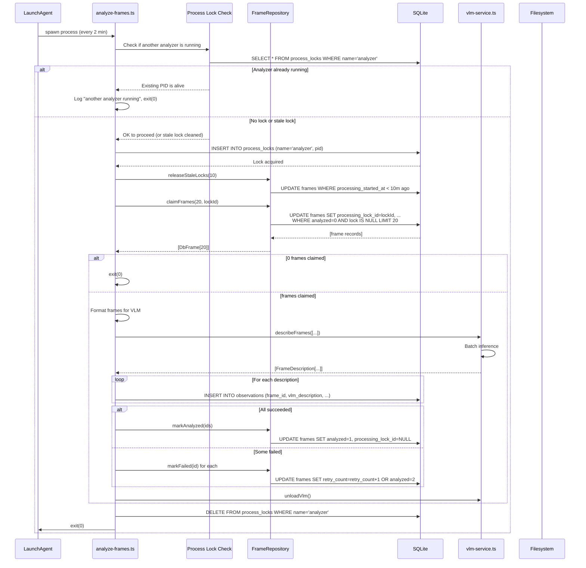

# TDD-002: Node Batch Analyzer

## 1. Overview

This document specifies the design for the Node Batch Analyzer (Phase 2). It periodically polls the `frames`
table, claims unanalyzed frames, passes them through the existing `vlm-service.ts`, and creates `observations`
with foreign keys to the frames.

## 1.1 Data Flow Diagram




## 2. Architecture & File Structure

- **Database Interfaces**: `src/db/repositories/frame.sqlite.ts`
- **Migration**: `src/db/migrations/015_observations_frame_fk.sql`
- **Action**: `src/actions/analyze-frames.ts`
- **CLI**: `src/index.ts` -> `escribano analyze`
- **Plist**: `com.escribano.analyze.plist` (managed in Phase 1's install command)

## 3. Core Components

### 3.1 Database Migration (015)

Adding `frame_id` as a foreign key to the `frames` table maintains referential integrity and enables efficient queries that cross-link observations back to their source frames. This is essential for the always-on recorder workflow, where:

1. **Referential Integrity**: Every `observations` row created from a frame references a `frames` record. With `ON DELETE SET null`, when the Phase 4 cleanup deletes old frame rows, observations retain their data but `frame_id` becomes `null`. This preserves the VLM analysis even after source images are cleaned up.
2. **Query Patterns**: With this FK, we can efficiently answer questions like:
   - "Show me all observations derived from frames captured in the last hour" (filter observations by `frame_id`, then filter frames by timestamp)
   - "Find all frames that failed to analyze" (query frames where `analyzed = 2`)
3. **Indexing Strategy**: The index `idx_observations_frame_id` enables O(log N) lookup on `frame_id`, making joins fast. This is especially important when the artifact generation pipeline later queries observations by frame ID to include source context.

```sql
ALTER TABLE observations ADD COLUMN frame_id TEXT REFERENCES frames(id) ON DELETE SET NULL;
CREATE INDEX idx_observations_frame_id ON observations(frame_id);

-- Process-level VLM concurrency control
-- Prevents multiple analyzer instances from running VLM simultaneously (which would cause OOM/GPU thrash)
CREATE TABLE IF NOT EXISTS process_locks (
  name       TEXT PRIMARY KEY,       -- e.g., 'analyzer'
  pid        INTEGER NOT NULL,
  started_at TEXT DEFAULT (datetime('now'))
);
```

### 3.2 Frame Repository (`FrameRepository`)

Defined in `src/db/repositories/frame.sqlite.ts`.

- `claimFrames(limit: number, lockId: string): DbFrame[]`
  - Executes:
    ```sql
    UPDATE frames
    SET processing_lock_id = ?, processing_started_at = datetime('now')
    WHERE id IN (
        SELECT id FROM frames
        WHERE analyzed = 0 AND processing_lock_id IS NULL
        ORDER BY timestamp ASC LIMIT ?
    ) RETURNING *
    ```
- `markAnalyzed(ids: string[])` -> Sets `analyzed = 1`, clears locks.
- `markFailed(id: string)` -> Increments `retry_count`. If `retry_count >= 3`, sets `analyzed = 2`,
  `failed_at = datetime('now')`. Clears locks.
- `releaseStaleLocks(timeoutMinutes: number)` ->
  `UPDATE frames SET processing_lock_id = NULL, processing_started_at = NULL WHERE processing_started_at < datetime('now', '-? minutes') AND analyzed = 0 AND processing_lock_id IS NOT NULL`

### 3.3 The Analyze Action (`analyze-frames.ts`)

**Process Model**: Each invocation is a single **ephemeral process** that claims frames, processes them, and exits. The launchd `StartInterval` provides the timing; the process itself is stateless.

**Pseudocode with Error Handling**:

```typescript
// src/actions/analyze-frames.ts

async function analyzeFrames() {
  let claimedFrames: DbFrame[] = []
  
  try {
    // Step 0: Acquire process-level lock to prevent concurrent VLM execution
    // (launchd won't spawn two instances, but manual CLI runs can overlap)
    const existingLock = await db.get(
      "SELECT * FROM process_locks WHERE name = 'analyzer'"
    )
    
    if (existingLock) {
      const isAlive = isProcessAlive(existingLock.pid)  // kill(pid, 0)
      if (isAlive) {
        console.log(`Another analyzer (PID ${existingLock.pid}) is running. Exiting.`)
        process.exit(0)  // Graceful exit; not an error
      }
      // Stale lock from crashed process — clean it up
      await db.run("DELETE FROM process_locks WHERE name = 'analyzer'")
    }
    
    // Acquire lock for this process
    await db.run(
      "INSERT INTO process_locks (name, pid) VALUES ('analyzer', ?)",
      [process.pid]
    )
    console.log(`Acquired analyzer lock (PID ${process.pid})`)
    
    // Step 1: Release any stale locks from crashed frame-level runs (timeout: 10 min)
    await frameRepository.releaseStaleLocks(10)
    
    // Step 2: Generate a unique lock ID for this run
    const lockId = generateUUIDv7()
    
    // Step 3: Claim up to 20 unanalyzed frames
    claimedFrames = await frameRepository.claimFrames(20, lockId)
    
    // If no frames to process, exit gracefully
    if (claimedFrames.length === 0) {
      console.log("No frames to analyze")
      process.exit(0)
    }
    
    console.log(`Analyzing ${claimedFrames.length} frames`)
    
    // Step 4: Format frames for VLM (map image_path and timestamp)
    const framesToProcess = claimedFrames.map(f => ({
      id: f.id,
      imagePath: f.image_path,
      timestamp: f.timestamp
    }))
    
    // Step 5: Invoke VLM batch inference
    let descriptions: FrameDescription[] = []
    try {
      descriptions = await vlmService.describeFrames(framesToProcess)
    } catch (vlmError) {
      // VLM failure (OOM, parse error, timeout)
      console.error("VLM inference failed:", vlmError.message)
      
      // Increment retry_count for all claimed frames
      for (const frame of claimedFrames) {
        try {
          await frameRepository.markFailed(frame.id)
          // markFailed increments retry_count; if >= 3, sets analyzed=2
        } catch (markError) {
          console.error(`Failed to mark frame ${frame.id} as failed:`, markError)
          // Continue with next frame; stale lock cleanup will handle this on next run
        }
      }
      
      // Exit with error; launchd will retry on next StartInterval
      throw new Error(`VLM inference failed, marked ${claimedFrames.length} frames for retry`)
    }
    
    // Step 6: Insert observations and delete JPEGs
    const failedIds: string[] = []
    
    for (let i = 0; i < claimedFrames.length; i++) {
      const frame = claimedFrames[i]
      const desc = descriptions[i]
      
      try {
        // Insert observation with frame_id FK
        await db.insert("observations", {
          id: generateId(),
          recording_id: "<synthetic-from-frames>", // Will be linked during segmentation
          type: "visual",
          frame_id: frame.id,
          timestamp: frame.timestamp,
          vlm_description: desc.description,
          activity_type: desc.activity,
          apps: JSON.stringify(desc.apps),
          topics: JSON.stringify(desc.topics)
        })
        
        // Note: JPEG retention is managed by Phase 4 cleanup task (ESCRIBANO_FRAME_RETENTION_DAYS)
        // Frames are kept on disk to enable future OCR, screenshots in artifacts, and re-analysis
        
      } catch (insertError) {
        console.error(`Failed to insert observation for frame ${frame.id}:`, insertError)
        failedIds.push(frame.id)
      }
    }
    
    // Step 7: Mark successfully processed frames as analyzed
    const successIds = claimedFrames
      .map(f => f.id)
      .filter(id => !failedIds.includes(id))
    
    if (successIds.length > 0) {
      await frameRepository.markAnalyzed(successIds)
      console.log(`Marked ${successIds.length} frames as analyzed`)
    }
    
    // If some frames failed to insert, try again next run
    if (failedIds.length > 0) {
      console.warn(`${failedIds.length} frames failed to insert; will retry on next run`)
      // Frames remain locked; releaseStaleLocks on next run will free them
      process.exit(1)
    }
    
    console.log("Batch analysis complete")
    process.exit(0)
    
  } catch (error) {
    // Outer catch: unexpected error (DB crash, etc.)
    console.error("Unexpected error during analysis:", error)
    
    // All claimed frames remain locked; releaseStaleLocks on the next run will free them
    // This is safe because launchd will retry via StartInterval
    
    process.exit(1)
    
  } finally {
    // Step 9: Always release process lock and unload VLM model
    try {
      await db.run("DELETE FROM process_locks WHERE name = 'analyzer'")
      console.log("Released analyzer lock")
    } catch (lockError) {
      console.error("Failed to release analyzer lock:", lockError)
    }
    
    try {
      await intelligenceService.unloadVlm()
    } catch (unloadError) {
      console.error("Failed to unload VLM:", unloadError)
    }
  }
}
```

**Error Handling Summary**:
- **VLM Failure**: Caught at batch level. All claimed frames increment `retry_count`; if >= 3, marked as `analyzed = 2` (failed).
- **DB Insert Failure**: Caught per-frame. Failed frame IDs remain locked; next run's `releaseStaleLocks(10)` frees them.
- **Crash During Processing**: Stale lock cleanup on next run frees all claimed frames for retry.
- **Memory Safety**: `finally` block ensures model is unloaded before exit, even if error occurs.

### 3.4 Process Model: Ephemeral Execution & VLM Concurrency Control

**Ephemeral Execution (No Tick/Worker Split)**:

Each launchd invocation spawns a **fresh, independent process** that:
1. Acquires process-level lock (prevents concurrent VLM execution)
2. Claims frames (locked by `processing_lock_id`)
3. Processes them (VLM inference)
4. Marks them analyzed
5. Releases process lock
6. Unloads model
7. Exits (process terminates)

**launchd Single-Instance Guarantee**:

launchd with `StartInterval=120` will not spawn a second instance if the first is still running. From Apple's documentation:

> If the job is already running when StartInterval fires, launchd does **not** launch a second instance.

This means launchd-managed processes are naturally serialized. **However**, users can invoke `escribano analyze` manually from the CLI while the launchd agent is running, which would bypass this protection. That's why we add a **process-level VLM lock** in `process_locks` table:

- When process A (launchd) starts VLM, it acquires the lock
- If user runs `escribano analyze` (process B) in a terminal, B checks the lock and sees A's PID is alive
- B gracefully exits with code 0 (not an error) and logs the message
- This prevents two VLM instances from loading simultaneously and causing GPU OOM / thrash

**Concurrency & Retry Safety**:
- **launchd timing**: `StartInterval=120` means a new process is spawned every 2 minutes (only if previous exited)
- **VLM lock**: `process_locks` table with PID check prevents manual CLI + launchd overlap
- **Frame-level double-claiming prevention**: If two processes somehow both acquired the VLM lock (e.g., both check PID at same instant):
  - Both call `claimFrames()`
  - Process A claims frames 1–20 (sets `processing_lock_id=<uuid-A>`)
  - Process B calls `claimFrames()`, gets frames 21–40 (sets `processing_lock_id=<uuid-B>`)
  - No conflict; the `WHERE processing_lock_id IS NULL` predicate ensures each frame is claimed only once
- **Crash recovery**: If process A crashes mid-VLM:
  - Process lock row remains with stale PID
  - Frame locks remain with stale `processing_lock_id` and `processing_started_at`
  - Next analyzer run (process B) checks if PID is alive (it's not), cleans up the lock, and continues
  - `releaseStaleLocks(10)` frees any frame locks older than 10 minutes

**Why No Tick/Worker Split?**:
- launchd already provides the **tick** (StartInterval scheduling)
- Each ephemeral process **is** the worker
- No need for internal event loop or background thread
- Simpler state machine (no long-lived actor coordination)
- Better resource management (model unloaded after every run, memory stays bounded)
- Process lock in SQLite is simpler than shared memory or OS-level mutexes

### 3.5 LaunchAgent Plist (`com.escribano.analyze.plist`)

- Created during `escribano recorder install` (implemented in Phase 1 but used here).
- `StartInterval=120` (runs every 2 minutes).
- `ProgramArguments`: `[node, <path_to_escribano_dist>, analyze]`.

## 4. Error Handling & Edge Cases

- **VLM Failure**: If the VLM throws (OOM, parse error), catch at the batch level. Increment `retry_count`.
   Max retries = 3.
- **Crash during VLM**: Handled by `releaseStaleLocks` on the next run.
- **Disk Full during Observation Write**: SQLite will throw. VLM work is lost. Stale lock cleanup will retry
   it later.
- **Memory Footprint**: Process is ephemeral (spawned by launchd, runs VLM, unloads, exits). It does not leak
   memory over days like a long-running Node process might.

## 5. Test Specs

- **Mock DB Claiming**: Create a test DB with 25 pending frames. Assert `claimFrames` locks exactly 20.
- **Stale locks recovery**: Set a frame's `processing_started_at` to 15 mins ago, ensure `releaseStaleLocks`
  frees it, and it gets claimed again.
- **Retry limit**: Mock a VLM failure 3 times, verify frame state becomes `analyzed = 2`.
- **Concurrent claiming**: Verify two parallel `claimFrames()` calls (via separate DB connections) do not claim the same frame.
- **Process lock - concurrent prevention**: Insert a `process_locks` row with an active PID (use current process). Start a second analyzer process. Assert it logs "Another analyzer running" and exits with code 0 (graceful, not error).
- **Process lock - stale lock recovery**: Insert a `process_locks` row with a dead PID (e.g., 99999999). Start analyzer. Assert it cleans up the stale lock, acquires a new one, and proceeds normally.
