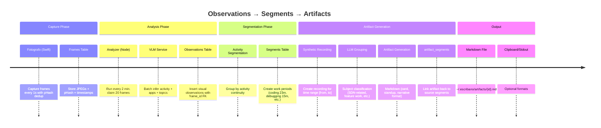
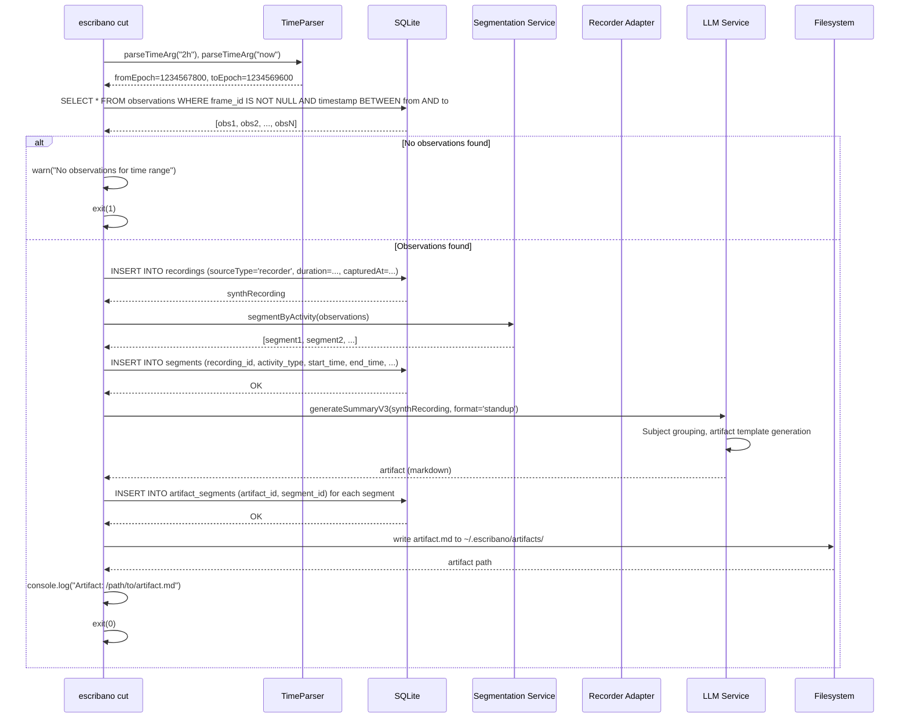

# TDD-003: Segmentation & CLI

## 1. Overview

This document specifies the design for the Segmentation pipeline and CLI interactions (Phase 3). It introduces
`segments` as an **append-only** record of work sessions, generates "synthetic recordings" for
continuous capture, and adds the `escribano cut` command to generate session summaries from arbitrary time
ranges.

> **User-triggered segmentation**: Segments do not exist as queryable entities until a user explicitly invokes `escribano cut`. The continuous pipeline produces frames and observations; segmentation and artifact generation are user-initiated. This is distinct from the video-file pipeline where `topic_blocks` are created automatically during `process-recording-v3`.

### 1.1 Data Flow Diagram



**Key Data Relationships**:
1. **frames** → observations: 1:N (one frame produces one observation via VLM)
2. **observations** → segments: N:1 (multiple observations grouped into one segment by activity continuity)
3. **segments** → recordings: N:1 (multiple segments per recording, all from same time window)
4. **artifact_segments**: N:N join (one artifact can reference multiple segments, one segment can be in multiple artifacts if cut multiple times)

## 2. Architecture & File Structure

- **Database Interfaces**: `src/db/repositories/segment.sqlite.ts`
- **Migration**: `src/db/migrations/016_segments.sql`
- **Capture Adapter**: `src/adapters/capture.recorder.adapter.ts`
- **Action**: `src/actions/cut-session.ts`
- **CLI**: `src/index.ts` -> `escribano cut`

## 3. Core Components

### 3.1 Database Migration (016)

The `segments` table stores **discrete work periods** identified by activity type and extracted from VLM-analyzed frames. Each segment represents a contiguous span of related activity (e.g., "coding in VS Code for 23 minutes", "debugging terminal errors for 15 minutes"). For always-on recorder runs, `segments` replaces `topic_blocks` as the primary unit of work state. The `artifact_segments` join table links generated artifacts (summaries) back to the segments they were derived from, enabling auditability and cross-session analysis (e.g., "which segments contributed to this standup?").

```sql
CREATE TABLE segments (
  id              TEXT PRIMARY KEY,
  recording_id    TEXT REFERENCES recordings(id),
  start_time      REAL NOT NULL,
  end_time        REAL NOT NULL,
  activity_type   TEXT NOT NULL,
  apps            TEXT,                -- JSON array
  topics          TEXT,                -- JSON array
  classification  TEXT,                -- JSON context payload
  created_at      TEXT DEFAULT (datetime('now'))
);
CREATE INDEX idx_segments_recording ON segments(recording_id);
CREATE INDEX idx_segments_time_range ON segments(start_time, end_time);

CREATE TABLE artifact_segments (
  artifact_id TEXT NOT NULL REFERENCES artifacts(id) ON DELETE CASCADE,
  segment_id  TEXT NOT NULL REFERENCES segments(id) ON DELETE CASCADE,
  PRIMARY KEY (artifact_id, segment_id)
);
CREATE INDEX idx_artifact_segments_segment ON artifact_segments(segment_id);
```

### 3.2 Segment Repository (`SegmentRepository`)

Defined in `src/db/repositories/segment.sqlite.ts`.

- `saveBatch(segments: DbSegment[])`
- `findByRecording(recordingId: string): DbSegment[]`

### 3.3 Synthetic Recordings

Continuous capture doesn't have discrete video files, so we generate a "synthetic recording" to satisfy
existing artifact pipelines.

- When `escribano cut` is run, we insert a synthetic recording into the DB:
  ```typescript
  const synthRecording = {
    id: generateId(),
    sourceType: "recorder", // Discriminator
    videoPath: null,
    capturedAt: formatISO(fromTimestamp),
    duration: toTimestamp - fromTimestamp,
    status: "processed",
  };
  ```
- `generate-summary-v3.ts` remains unaware of the difference; it just expects a recording row and its related
  block groupings.

### 3.4 The Cut Command (`escribano cut`)

**Sequence Diagram: `escribano cut --from 2h --to now --format standup`**



**Pseudocode Implementation**:

```typescript
// src/actions/cut-session.ts

async function cutSession(options: {
  from?: string           // Relative like "2h" or absolute ISO timestamp
  to?: string            // Relative like "now" or absolute ISO timestamp
  format?: string        // "card", "standup", "narrative"
  stdout?: boolean
  copy?: boolean
}) {
  try {
    // Step 1: Resolve time arguments
    const toEpoch = options.to 
      ? parseTimeArg(options.to) 
      : Date.now() / 1000
    const fromEpoch = options.from 
      ? parseTimeArg(options.from) 
      : toEpoch - (4 * 3600)  // Default: 4 hours ago
    
    console.log(`Cutting session from ${new Date(fromEpoch * 1000).toISOString()} to ${new Date(toEpoch * 1000).toISOString()}`)
    
    // Step 2: Fetch observations for time range
    const obsFrames = await db.query(
      "SELECT * FROM observations WHERE frame_id IS NOT NULL AND timestamp BETWEEN ? AND ? ORDER BY timestamp ASC",
      [fromEpoch, toEpoch]
    )
    
    if (obsFrames.length === 0) {
      console.warn("No observations found for time range")
      process.exit(1)
    }
    
    console.log(`Found ${obsFrames.length} observations`)
    
    // Step 3: Create synthetic recording
    const synthRecording: DbRecording = {
      id: generateId(),
      sourceType: "recorder",
      videoPath: null,
      capturedAt: new Date(fromEpoch * 1000).toISOString(),
      duration: toEpoch - fromEpoch,
      status: "processed",
      createdAt: new Date().toISOString()
    }
    
    await db.insert("recordings", synthRecording)
    console.log(`Created synthetic recording: ${synthRecording.id}`)
    
    // Step 4: Segment observations
    const segments = segmentByActivity(obsFrames)
    console.log(`Segmented into ${segments.length} activities`)
    
    // Step 5: Save segments to DB
    const dbSegments = segments.map(seg => ({
      id: generateId(),
      recording_id: synthRecording.id,
      start_time: seg.startTime / 1000,  // Convert ms to seconds
      end_time: seg.endTime / 1000,
      activity_type: seg.activity,
      apps: JSON.stringify(seg.apps),
      topics: JSON.stringify(seg.topics),
      classification: JSON.stringify(seg.fullContext)
    }))
    
    await segmentRepository.saveBatch(dbSegments)
    console.log(`Saved ${dbSegments.length} segments to DB`)
    
    // Step 6: Generate artifact via existing pipeline
    const format = options.format ?? "card"
    const artifact = await generateSummaryV3(synthRecording, format)
    console.log(`Generated artifact: ${artifact.id}`)
    
    // Step 7: Link artifact to segments
    for (const seg of dbSegments) {
      await db.insert("artifact_segments", {
        artifact_id: artifact.id,
        segment_id: seg.id
      })
    }
    console.log(`Linked artifact to ${dbSegments.length} segments`)
    
    // Step 8: Output
    const filePath = artifact.filePath
    console.log(`Artifact: ${filePath}`)
    
    if (options.stdout) {
      console.log("")
      console.log(artifact.markdown)
    }
    if (options.copy) {
      clipboard.copy(artifact.markdown)
      console.log("Copied to clipboard")
    }
    
    process.exit(0)
    
  } catch (error) {
    console.error("Error during cut:", error)
    process.exit(1)
  }
}
```

**Trigger**: `escribano cut --from <time> --to <time> [--format <format>]`
  - `<time>` can be relative (e.g., `2h`, `30m` = ago) or exact ISO timestamps.
  - Default bounds if omitted: `from: 4h` (4 hours ago), `to: now`.

### 3.5 Recorder Capture Adapter (`capture.fotografo.adapter.ts`)

- Implements `CaptureSource` interface.
- `getLatestRecording()`: Fetches the most recently generated synthetic recording (where
  `sourceType = 'recorder'`).
- `listRecordings()`: Returns all synthetic recordings.

**Naming Rationale**: Named `capture.fotografo.adapter.ts` to align with the Swift capture agent "Fotógrafo" (The Photographer). This reinforces the theme consistency across the recorder pipeline and makes the source clear at a glance.

### 3.6 Segmentation Algorithm

The `segmentByActivity()` function is implemented in `src/services/activity-segmentation.ts`. This section specifies its behavior for the recorder pipeline.

**Grouping Logic**:
- Filters to visual observations with VLM descriptions, sorted by timestamp
- Extracts activity type from each observation's `vlm_description` using `extractActivityType()` (pattern matching against activity keywords: debugging, coding, review, meeting, research, reading, terminal, other)
- Starts a new segment when activity type changes from the previous observation
- Continues the current segment when activity type matches

**Minimum Segment Duration**: 30 seconds (configurable via `minSegmentDuration`)
- Segments shorter than this threshold are merged into their longest neighbor (previous or next)
- Merge logic in `mergeShortSegments()` chooses the neighbor with greater duration
- This prevents fragmented segments from rapid activity switching (e.g., coding → browser → coding in 3 minutes)

**Interleaving**: Not explicitly handled
- If activities interleave rapidly, you get multiple segments
- The short-segment merge may collapse the middle one(s)
- Example: `coding(2m) → browser(30s) → coding(2m)` → becomes `coding(4.5m)` if browser segment is merged

**Apps/Topics Extraction**:
- Extracted from VLM descriptions per observation
- Aggregated per segment (union of all observation apps/topics in that segment)

### 3.7 Time Argument Parsing (`parseTimeArg`)

The `parseTimeArg()` function converts user-provided time arguments to Unix epoch seconds.

**Supported Formats**:
- **Relative (ago)**: `"2h"`, `"30m"`, `"90s"` — interpreted as `now - duration`
- **Absolute**: ISO 8601 timestamp (e.g., `"2024-03-12T10:00:00Z"`)
- **Special**: `"now"` — current time

**Combined Formats**: Not supported for MVP
- `"2h30m"` is rejected — user should use `"150m"` instead
- Rationale: Keeps parsing simple; combined formats add complexity with minimal UX benefit

**Timezone**: All times use local machine timezone
- `Date.now()` for "now"
- ISO timestamps without timezone are interpreted as local time
- No `--timezone` flag for MVP

**Error Handling**:
- Invalid input: Print `"Invalid time argument: '<input>'. Use relative (e.g., '2h', '30m') or ISO 8601 timestamp."` and exit with code 1
- Examples of invalid: `"2h30m"`, `"yesterday"`, `"next week"`, empty string

**Default Behavior** (if arguments omitted):
- `--from`: 4 hours ago (`Date.now() / 1000 - 4 * 3600`)
- `--to`: now (`Date.now() / 1000`)

## 4. Artifact Compatibility Bridging

Currently, `generate-summary-v3.ts` queries `DbTopicBlock`. For recorder runs (which produce `segments` instead of `topic_blocks`), we need a dispatch strategy at artifact generation time.

**Option A: Alias at Query Time (Chosen for MVP)**

Modify `generate-summary-v3.ts` to check the recording's `sourceType` and adapt accordingly:

```typescript
// src/actions/generate-summary-v3.ts

async function generateSummaryV3(recording: DbRecording, format: string) {
  let blocks: ITopicBlock[]
  
  if (recording.sourceType === "recorder") {
    // Fetch segments instead of topic_blocks
    const segments = await db.segments.findByRecording(recording.id)
    
    // Adapt each segment to the ITopicBlock interface
    blocks = segments.map(seg => ({
      id: seg.id,
      recording_id: seg.recording_id,
      topicLabel: `${seg.activity_type}: ${seg.topics?.length ? seg.topics.join(", ") : "unclassified"}`,
      startTime: seg.start_time * 1000,  // Convert seconds to ms
      endTime: seg.end_time * 1000,
      duration: (seg.end_time - seg.start_time) * 1000,
      apps: seg.apps ? JSON.parse(seg.apps) : [],
      activities: [seg.activity_type],
      classification: seg.classification ? JSON.parse(seg.classification) : {},
      created_at: seg.created_at
    }))
  } else {
    // Original path: fetch topic_blocks for file-based recordings
    blocks = await db.topicBlocks.findByRecording(recording.id)
  }
  
  // Generate artifact from blocks (same code path for both)
  return generateArtifact(blocks, recording, format)
}
```

**Risk Assessment**:

| Risk | Mitigation | Priority |
|------|-----------|----------|
| **Schema drift**: `DbSegment` and `DbTopicBlock` diverge over time | Keep the adapter lightweight (3–5 property mappings). Add comprehensive tests for both paths (file-based + recorder). Write interface tests that verify both adapters produce compatible ITopicBlock shapes. | High |
| **Dual-path maintenance**: Two ways to populate artifacts means testing burden doubles | Use schema-agnostic tests (prefer interface contracts over DB schema assertions). Write a shared test fixture that generates mock blocks for both paths and verifies output Markdown matches format specs. | High |
| **Query performance**: Segment queries may lack the same indexes as topic_blocks | Ensure both `idx_segments_recording` and `idx_segments_time_range` are applied. Monitor query plans via `.explain query plan` during integration tests. | Medium |
| **Field mismatch on artifact**: Segment data may be too sparse or structured differently | Document exactly which segment fields map to which ITopicBlock fields. If gaps emerge, add a null-coalescing step in the adapter (e.g., `apps: seg.apps ? JSON.parse(seg.apps) : []`). | Medium |
| **Future refactor**: Should we merge `segments` and `topic_blocks` into one table? | Defer to Phase 4+. Add a TODO comment in code: `// TODO: Consider unified segments table post-Phase 3`. This is a schema cleanup, not a blocker. | Low |

**Advantages of This Approach**:
- **Minimal changes**: Only one adapter function in `generate-summary-v3.ts`, no changes to downstream artifact generation logic.
- **Clear dispatch**: Recording type is explicit and observable in logs.
- **Easy to test**: Both paths can be unit tested in isolation by mocking DB layer.

## 5. Test Specs

- **Cut Time Parsing**: Test `parseTimeArg('2h')` computes correctly against the current date.
- **End-to-End Pipeline**: Insert mock visual observations with `frame_id`s. Call `cut --from 1h --to now`.
  Verify:
  1. A synthetic recording is created.
  2. Segments are accurately bounded.
  3. The generated artifact is linked in `artifact_segments`.
- **Append-only behavior**: Calling `cut` twice over overlapping time ranges should create _two independent_
  synthetic recordings, with _duplicated_ segments. 
  > **Note**: Overlapping cuts may summarize the same work twice in separate artifacts. This is intentional — each `cut` invocation represents a distinct user intent (e.g., daily standup vs weekly retrospective). The `artifact_segments` join table ensures each artifact references its own segments independently.
